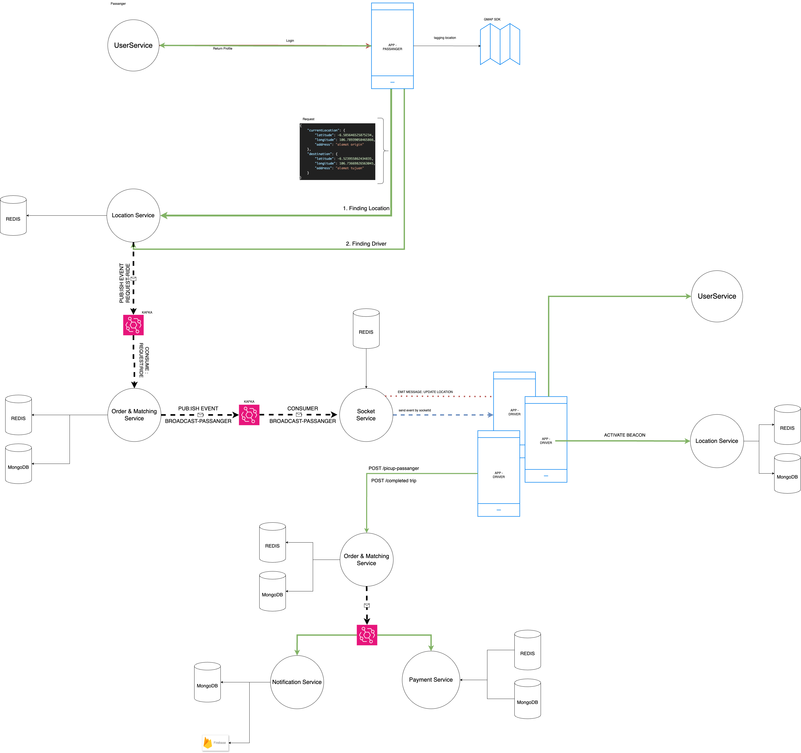

# User Service
This project written in javascript using ExpressJS based on a clean architecture that represents DDD and CQRS patterns. 

[](https://sonarcloud.io/summary/new_code?id=thrive-roadshow_node-thrive)
[](https://sonarcloud.io/summary/new_code?id=thrive-roadshow_node-thrive)
[](https://sonarcloud.io/summary/new_code?id=thrive-roadshow_node-thrive)

## Project Structure
- [ ] `src/`
  - [ ] `app/`: server.
  - [ ] `auth/`: contains auth middleware.
  - [ ] `helpers/`
    - [ ] `databases/`: contains database configurations and commands.
  - [ ] `infra/`: define the app configuration.
  - [ ] `modules/`: define the core domain.
    - [ ] `users/`: user modules domain.
      - [ ] `handlers/`: defines call handlers from repositories.
      - [ ] `repositories/`: contains user commands and queries.
      - [ ] `utils/`: contains domain utils.
- [ ] `test/`: contains testing purpose.
  - [ ] `integration/`
  - [ ] `unit/`

## Getting Started
### Prerequisites

What things you need to install to run this project:

```
- Node.js v20
- Node Package Manager v10
- MongoDB
- Kafka
- RedisDB
```

### Quick Start
To run this project, make sure that all prerequisites above are installed on your machine. Steps on how to initialize and run this project are as follows:

1. Clone this repo to your local machine

2. Install dependencies:
   ```
   $ npm install
   ```
3. Set file .env base on .env.example

4. Start the server:
   ```
   $ npm run start
   ```

### Running the tests

Just simply use this command to run the automated tests:
```
$ npm run test
```

Get coverage value for this system:
```
$ npm run cover
```

### Check coding style with lint analysis ###
It is encouraged to run lint analysis before push your code to make sure that there are no issues on your coding style / formatting
```
$ npm run lint
```

To fix simple error code format, run this command
```
$ npm run lint:fix
```

## NEBENGJEK
### Description
NebengJek is a ride-sharing app that connects users with shared rides, system is very lite, simple,
and fast. Users can either be Riders, requesting a ride, or Drivers, offering their vehicle. 
Both can choose whom to ride with, as long as they're within a specific area.

### Architecture

### System Flow



### DFD


### Author
* [Farid Tri Wicaksono](https://github.com/farid-alfernass)

### Built With

* [ExpressJS] The rest framework used
* [Npm] - Dependency Management
* [Docker] - Container Management

